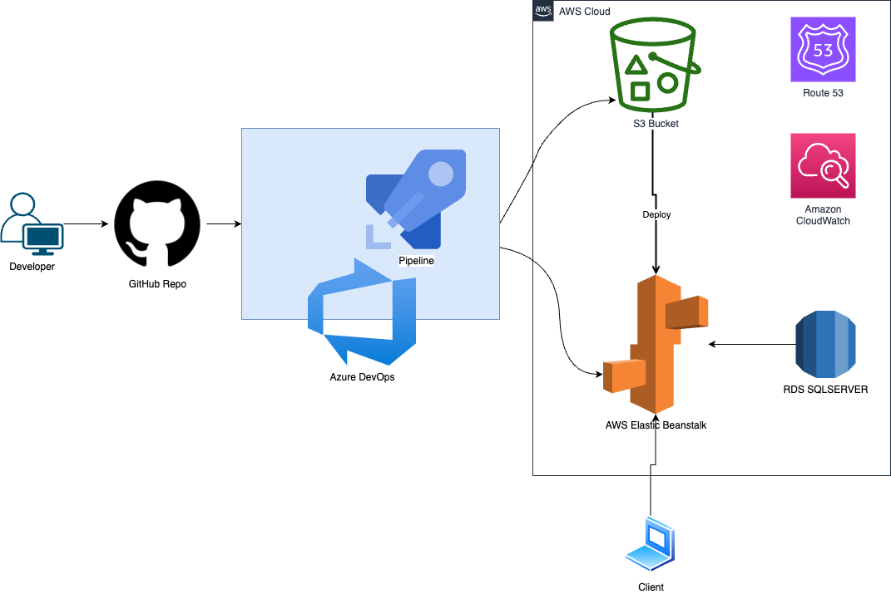
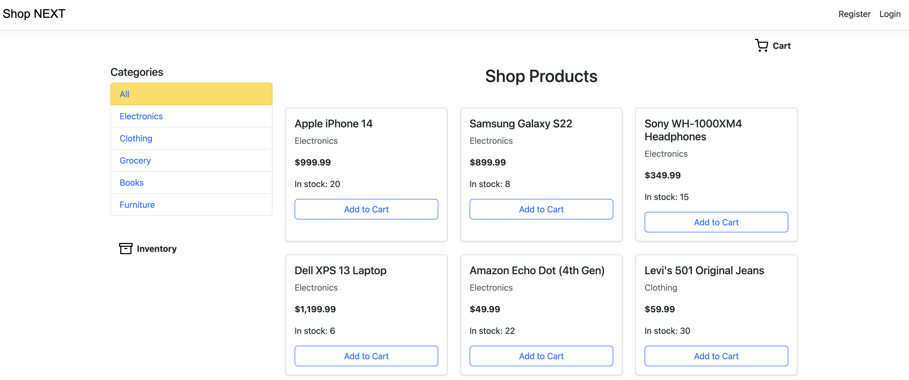
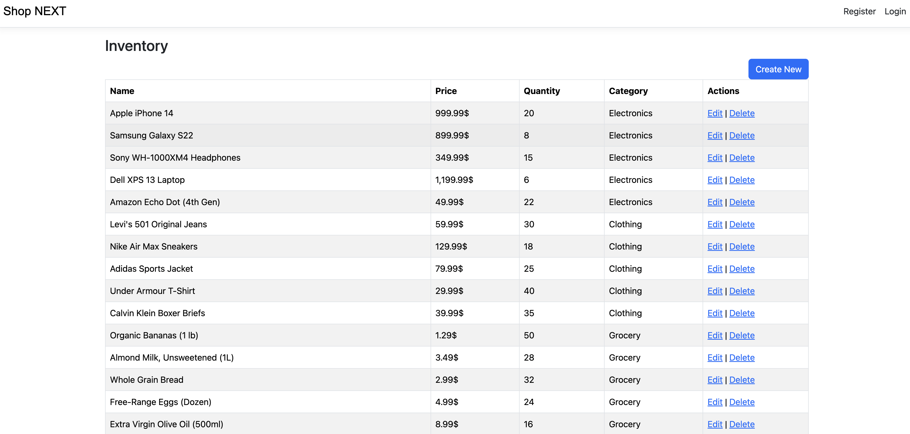
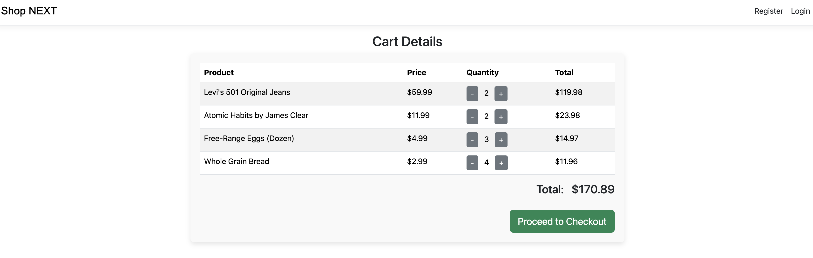
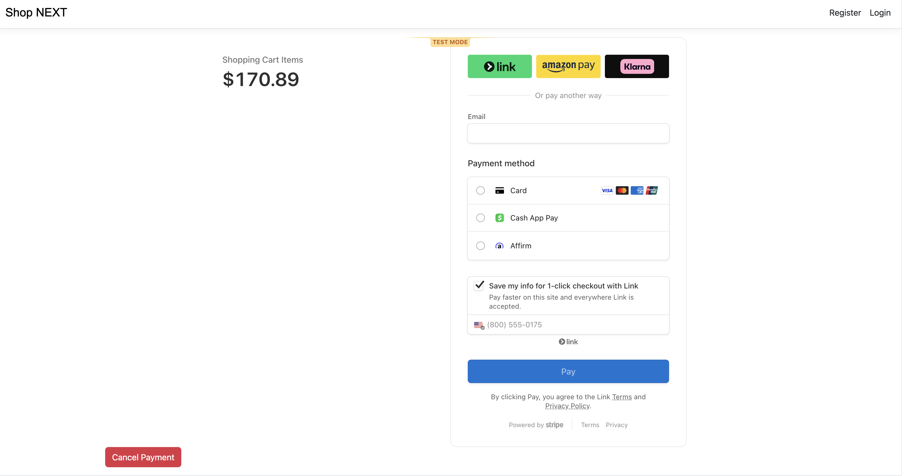
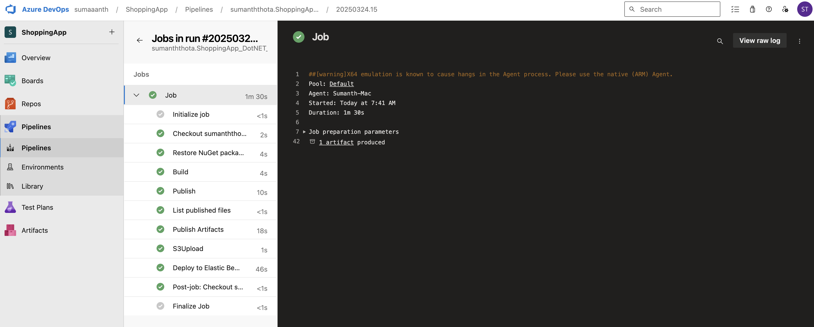

# Shop NEXT  --- ASP .NET 9 WEB MVC

Welcome to ShoppingApp. This project highlights my development skills through rapid iteration, high-quality coding standards, cloud deployment strategies, CI/CD pipeline integration, data migrations, network troubleshooting, session management, and extensive database connectivity.


🌐 **[Shop NEXT Live Link](http://www.shopnext.name)**


## Architecture




## 📁 Project Structure
````
/Shop Next
│
├── Controllers
│   └── C#    
│
├── Models
│   └── C#                  
│   
├── Data
│   └── Migrations                 
│   └── MyAppContext.cs  
│         
├── Views
│   └── cshtml        
│
├── pipeline
│   └── GitHub
│   └── Azure DevOps
│   └── AWS Elastic Beanstalk
│
├── appsettings.json               
├── Program.cs                    


````

## Features

- **Product Catalog** 
- **Shopping Cart** 
- **Stripe Checkout Integration** 
- **User Authentication**
- **Inventory Management**
- **Session Management**


## Technology Stack

- **Backend:** .NET 9.0 / C#
- **Frontend:** Razor Pages / MVC
- **Database:** Azure Sql Edge / RDS SQL Server / Entity Framework Core
- **Containerization:** Docker
- **Tools:** JetBrains Rider, Git, MacBook Air M2
- **Cloud:** AWS Elastic Beanstalk, S3, Route 53, EC2, RDS, VPC, Subnets, Security Groups, TSL/SSL
- **CI/CD:** GitHub, Azure DevOps Pipelines
- **Deployment:** AWS Elastic Beanstalk
- **Payment Gateway:** Stripe

---

## Landing Page



---

## Inventory



---

## Cart



---

## Payment Gateway



---

## Azure Devops CI/CD



---

Thank you for reviewing my project journey. Feedback is appreciated.
